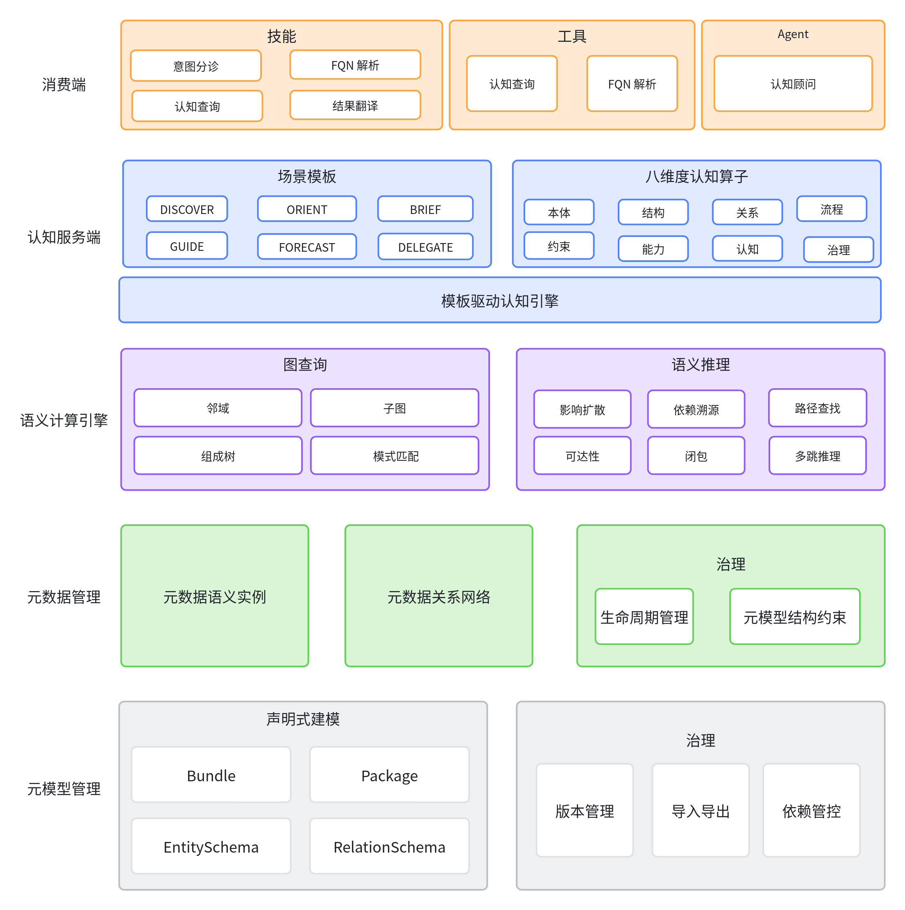

# MetaForge (元数据中间件 · AI Agent 业务语义底座)

[](https://opensource.org/licenses/Apache-2.0)
[](./docs/concepts/semantic-blueprint.md)
[](./docs/concepts/cognition-templates.md)
[](./docs/examples)
[](./docs/architecture.md)
[](./docs/contracts/INDEX.md)
[](./README.md#快速开始)

> MetaForge 是**元数据驱动的 AI 中间件**——正如关系型数据库是 Web 应用的数据底座，MetaForge 是 AI Agent 的语义底座。它不存业务数据，只存"数据的说明书"（结构化元数据）：统一描述业务领域内的概念定义、语义关系、规则约束与能力边界，让 AI Agent 从"凭训练先验想象业务"变为"查询语义说明书执行业务"。

---

## 为什么需要 MetaForge

大语言模型善于"生成"，却未必"懂业务"。当 AI Agent 面对具体业务场景，普遍遇到三大障碍：

1. **不懂业务**：模型先验里没有你的业务（虚构的流程、阈值、对象结构）——实测中，Agent 对虚构业务只能回答"不知道"
2. **乱执行**：无明确的规则与边界约束，可能越权、超范围、凭猜测执行
3. **无边界**：上下文全量注入冗余低效，分不清"哪些是我该知道的"

RAG 给碎片化文本、向量库给相似片段、规则引擎把规则焊死在代码里——都难以让 Agent"有据可依"地懂业务。

## 核心亮点

| 亮点 | 说明 |
|------|------|
| **元数据驱动** | 全链路以元数据为核心：元模型定义结构 → 元数据填充语义 → 关系网络连接认知，纯元数据不触碰业务数据 |
| **语义说明书范式** | 不存数据、存数据的说明书（结构化元数据）；数据归数据、语义归语义（见 [概念](./docs/concepts/semantic-blueprint.md)） |
| **六大认知模板** | DISCOVER/ORIENT/BRIEF/GUIDE/FORECAST/DELEGATE，覆盖 Agent 认知全链路（见 [模板](./docs/concepts/cognition-templates.md)） |
| **八维度认知模型** | 一套语义模型覆盖所有认知维度（是什么→怎么做→元认知） |
| **自建语义库** | 内置 agent 库开箱即用，更支持按业务自建 Bundle，多库并存按需消费 |
| **确定性认知** | FQN 解析绝不臆造、决策每一步可溯源到说明书规则 |
| **说明书指导执行** | 同一份说明书，对不同数据产生不同且正确的结论 |

## 如何改变 AI Agent

MetaForge 让 Agent 从"会聊天的模型"进化为"懂业务的执行者"：

- **认知来源**：训练先验 → 实时查询语义说明书
- **决策方式**：LLM 猜测 → 说明书规则对照（"800 > 500 → 转复核"，有据可依）
- **执行边界**：单 Agent 自由发挥 → DELEGATE 委派，子 Agent 只接触职责内认知
- **业务纵深**：通用对话 → 精通医疗/工业/数据中心/供应链等垂直业务

> 数据是流水，说明书是航道——MetaForge 管航道，Agent 沿着航道稳稳执行业务。

深入阅读：[如何改变 AI Agent](./docs/ai-agent-value.md)

## 架构

> 架构自下而上为**构建/依赖**方向（元模型是底座）；运行时请求方向相反——消费端发起，自上而下调用。



认知算子不是简单查表，而是**沿语义关系网络做图查询与推理**——影响扩散、依赖溯源、路径推理支撑了变更影响（FORECAST）等复杂认知，这是"元认知"区别于"数据查询"的技术根基。

详见 [架构](./docs/architecture.md)。

## 快速开始

### Docker 一键启动（含 PostgreSQL + 数据初始化）

```bash
cd docker
docker compose up --build -d     # 启动 boot + postgres，自动跑 V4 迁移 + 应用 seed
curl http://localhost:8080/actuator/health   # 等 UP
```

第一个认知查询：

```bash
curl -s -X POST http://localhost:8080/api/v1/cognition/BRIEF \
  -H 'Content-Type: application/json' \
  -d '{
    "scope": {"bundles":["metaforge:1.0.0"],"packages":[],"domainGroups":[],"domains":[],"entitySchemas":[]},
    "params": {"entity_fqn":"metaforge:1.0.0.agent.Task_InventoryCheck"},
    "format":"JSON","cognitionDepth":"L3","agentArchetype":"EXECUTION","maxTokens":8000
  }'
```

### opencode Agent 消费

在 opencode 环境，Agent 通过 metaforge 技能与工具即可消费认知服务（详见 `metaforge-cli/.opencode/`）：

```
opencode run "你是药剂审核 Agent，执行处方审核任务：查处方审核任务说明书，读 rx-002.json 对照规则报告处置。"
```

## 示例场景

| 示例 | 说明 |
|------|------|
| [医疗处方审核](./docs/examples/medical-prescription-review.md) | 剂量>500mg 转药师复核 |
| [工业设备预测性维护](./docs/examples/industrial-predictive-maintenance.md) | 两级阈值 + 故障类型判断 + 运行强制规则 |
| [数据中心机柜巡检](./docs/examples/datacenter-rack-inspection.md) | 三业务对象 + 固件升级策略决策嵌套 |
| [供应链库存补货](./docs/examples/supply-chain-replenishment.md) | 补货阈值（含等于触发）+ 供应商择优 |

## 文档导航

- [概念：语义说明书范式](./docs/concepts/semantic-blueprint.md)
- [概念：六大认知模板与八维度认知模型](./docs/concepts/cognition-templates.md)
- [价值：如何改变 AI Agent](./docs/ai-agent-value.md)
- [架构](./docs/architecture.md)
- [示例](./docs/examples/)
- [接口契约](./docs/contracts/INDEX.md)（6 场景模板 + 公共约定的详细契约）

## 开源协议

本项目采用 **Apache License 2.0** 开源。详见 [LICENSE](./LICENSE)。

```
Copyright 2026 MetaForge Contributors

Licensed under the Apache License, Version 2.0 (the "License");
you may not use this project except in compliance with the License.
You may obtain a copy of the License at

    http://www.apache.org/licenses/LICENSE-2.0
```

允许商业使用、修改、分发，含专利授权与贡献者条款；使用本项目请在显著位置保留版权与许可声明。
